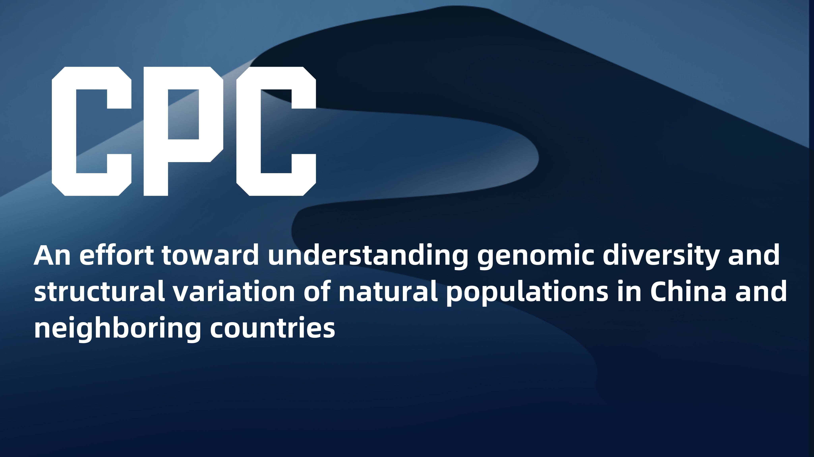

# Chinese Pangenome Consortium (Phase I)

## Introduction

Despite over the last two decades the reference human genome sequence has served as the foundation for genetic and biomedical research and applications, there is a broad consensus that no single reference sequence can represent the genomic diversity of global populations. 

On one hand, high-quality **population-specific** and **haplotype-resolved** genome references are necessary for genetic and medical analysis. On the other hand, there is a clear need to shift **from a single reference to a pangenome** form that better represents genomic diversity, or allelic variation within and across human populations. 

Here, we present the first effort (Phase I) of the Chinese Pangenome Consortium (CPC) with **the draft CPC pangenome reference** based on **116** high-quality haplotype-resolved assemblies from **58** core samples representing **36** minority Chinese ethnic groups and **6** assemblies of the Han Chinese.

## Files

- ### CPC pangenome reference 

	- The Pangenome References built based on the CPC core samples and that combined with the HPRC samples are freely available from [here](https://pog.fudan.edu.cn/cpc/#/data). 
  
- ### Haplotype-resolved assemblies generated by hifiasm (`.fasta`) 

	- Assemblies of [57 samples](https://ngdc.cncb.ac.cn/search/?dbId=gwh&q=PRJCA011422) only using **HiFi reads** (including low-quality Assemblies of 10 non core samples).

	- Assemblies of another [11 samples](https://ngdc.cncb.ac.cn/search/?dbId=hra&q=PRJCA011461) using **HiFi reads** and paid end **Hi-C reads**.

## Pipeline

The processing flow and details can be obtained from the [protocol](pipeline/protocol.md).

## Publication

> A Pangenome Reference of 36 Chinese populations, 13 October 2022, PREPRINT (Version 1) available at Research Square, DOI: [10.21203/rs.3.rs-2097264/v1](https://doi.org/10.21203/rs.3.rs-2097264/v1).

## Contact

- Correspondence and requests for materials should be addressed to S.X. (Email: xushua@fudan.edu.cn).
- For technical questions and bug reports, please contact Y.G. (Email: gaoyang@fudan.edu.cn).

## See also

|**Chinese Pangenome Consortium**||
|-|-|
|**Human Population Omics Group**||
